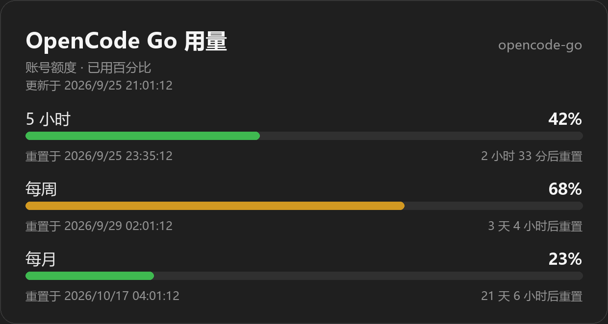
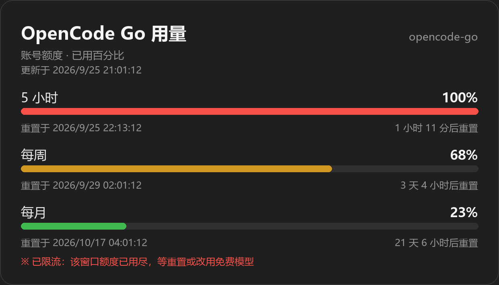
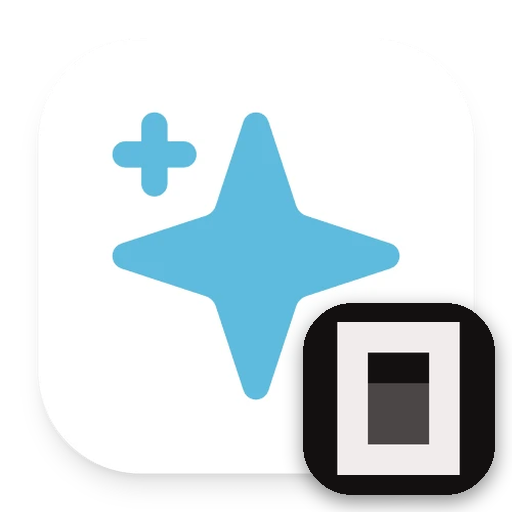

# astrbot_plugin_opencode_go_session

[](https://astrbot.app)
[](LICENSE)

给 [OpenCode Go](https://opencode.ai/docs/go/) 注入**按会话独立**的 `x-opencode-session` 请求头。

## 问题

OpenCode Go 要求每个请求带上会话 ID，否则直接返回 400：

```json
{"type":"error","error":{"type":"MissingSessionID","message":"Request is missing x-opencode-session and cannot be routed efficiently. Please see https://opencode.ai/docs/go/#where-can-i-use-it"}}
```

在 AstrBot 里表现为：

```
LLM 响应错误: All chat models failed: BadRequestError: Error code: 400 - {'type': 'error', 'error': {'type': 'MissingSessionID', ...}}
```

AstrBot 的 provider 配置里有「自定义请求头」（`custom_headers`），但只能填一个**静态值**，
所有群聊和私聊共用一个 session，Go 的路由亲和性与 prompt caching 就没法按会话生效。

## 原理

1. `on_llm_request` 钩子取当前会话 ID，写入 `ContextVar`
   （钩子与后续 provider 调用在同一个 async task，因此并发安全）
2. `on_astrbot_loaded` 以及每次 `on_llm_request` 包装 OpenCode provider 的 SDK 资源：
   `chat.completions` / `messages` / `responses` 的 `create`
3. 包装后的 `create` 从 `ContextVar` 读取会话 ID，作为 `extra_headers` 传给 SDK
   （`extra_headers` 是 OpenAI SDK 的正式参数，会与 `default_headers` 合并，且按请求优先）

判定哪个 provider 是 OpenCode：`provider_config["api_base"]` 含 `opencode.ai`（可配置）。

没走消息管线的调用（插件自己的后台请求、生成会话标题等）拿不到会话 ID，此时不注入，
仍由 provider 配置里的静态 `custom_headers` 兜底。

## 安装

在 AstrBot WebUI 的插件市场安装，或手动放到数据目录：

```
AstrBot/data/plugins/astrbot_plugin_opencode_go_session/
```

重启 AstrBot，日志出现下面这行即为生效：

```
[astrbot_plugin_opencode_go_session] 已为 1 个 provider 客户端安装 x-opencode-session 注入（匹配 'opencode.ai'）
```

### 建议同时保留静态兜底

在「模型提供商」里给 OpenCode Go 那个 provider 的自定义请求头加一条静态
`x-opencode-session`，这样插件未加载或后台调用没有会话上下文时也不会退回 400，
只是退化成所有会话共用一个 session：

```json
"custom_headers": { "x-opencode-session": "astrbot-ocgo-0001" }
```

## 命令：`/ocgo` 用量查询

发送 `/ocgo`（别名 `/opencode用量`、`/go用量`）查看三档用量与各自的重置时间。

默认输出一张用量卡片图，进度条颜色随用量从绿到黄到红：



某个窗口额度用尽时（`status` 为 `rate-limited`），该档变红并在卡片底部追加说明：



图是**本地用 Pillow 画的**，不依赖浏览器、不依赖 AstrBot 的 t2i 配置，也不走网络。
把 `usage_render` 设为 `text` 则输出纯文本：

```
OpenCode Go 用量 · opencode-go
[5h] █─────────   4%  3 小时 12 分后重置（今天 23:21）
[1w] █─────────   1%  2 天 11 小时后重置（09-28 08:00）
[1m] ──────────   0%  29 天 20 小时后重置（10-25 16:59）
```

（上面两张图是把 `percent` 与 `resetsAt` 换成本地样例数据渲染出来的，
不是真实账户用量。）

三档限额互相独立：5 小时那档用完只影响 5 小时窗口，周/月额度仍在；反之月额度
用尽则三档全满。撞到限流后仍可等重置、改用免费模型，或在 console 里开启
**Use balance** 让它超限后降级为按量计费。

- 数据来源：`GET <api_base>/usage`（即 `https://opencode.ai/zen/go/v1/usage`），
  返回 `{usage: {rolling, weekly, monthly}}`，每档含 `status` / `percent` / `resetsAt`
- 用量是按订阅（API Key）结算的，不是按模型条目：即使配了 30 多个模型，
  同一个 key 也只查一次、只出一张卡（按 key 去重，卡片标题显示 source id）
- `rolling` = 滚动 5 小时窗口，`weekly` = 本周，`monthly` = 本月；对应 Go 的 20% / 50% / 100% 限额
- `resetsAt` 同时给出绝对时间与相对时间，时区由 `usage_timezone_offset` 控制（默认 UTC+8）
- 结果缓存 30 秒，连续查询不会重复打接口
- 图片落在 `data/plugin_data/astrbot_plugin_opencode_go_session/usage_<provider>.png`

字体自动查找微软雅黑 / 等线 / 黑体 / Noto CJK 等，可用 `usage_font` 指定。
纯文本模式下的进度条字符特意选用 GBK 可编码的 `█` / `─` / `※`，
避免中文 Windows 下控制台或 GBK 日志编码报错。

## 配置

| 键 | 默认 | 说明 |
| --- | --- | --- |
| `enable` | `true` | 总开关 |
| `session_source` | `session_id` | 会话 ID 来源；`unified_msg_origin` 表示按聊天窗口（同一个群/好友的所有会话共用一个 ID） |
| `hash_session` | `true` | 对会话 ID 取 sha256 前 32 位，避免群号/用户 ID 明文外发给 OpenCode |
| `session_prefix` | `astrbot` | ID 前缀，留空则不加 |
| `header_name` | `x-opencode-session` | 请求头名 |
| `match_api_base` | `opencode.ai` | 只对 `api_base` 含该串的 provider 生效 |
| `fallback_session` | 空 | 无会话上下文时的兜底值，留空则不注入 |
| `usage_enable` | `true` | 是否启用 `/ocgo` 命令 |
| `usage_admin_only` | `false` | 开启后仅 AstrBot 管理员可用 |
| `usage_timezone_offset` | `8` | 重置时间的时区偏移（小时），支持小数如 `5.5`、`0` |
| `usage_render` | `auto` | `auto` / `image` / `text`，图片失败自动回退文本 |
| `usage_font` | 空 | 卡片字体文件路径，留空自动查找中文字体 |
| `fix_admin_only` | `true` | `/ocgo fix` 仅管理员可用（会改写配置，建议保持开启） |

## 命令：`/ocgo fix` 一键修复协议错配

OpenCode Go 按模型分了三种协议端点（见[官方 Endpoints 表](https://opencode.ai/docs/go/)），
而 AstrBot 是按 provider 类型发请求的。最常见的翻车就是把 Responses 专用的模型
（`gpt-6-luna`、`gpt-5.6-luna`、`grok-4.7/4.6`、`muse-spark-*-contributor`）
或 Messages 专用的模型（`minimax-m*`、`qwen3.*`）挂在了 Chat 类型的 provider 下，
结果每次调用都是：

```
400 {'type': 'error', 'error': {'type': 'ModelProtocolUnsupported', 'message': 'Model does not support this protocol.'}}
```

`/ocgo fix` 会自动处理（先备份 `cmd_config.json` 为 `.bak-ocgofix`）：

1. 扫描所有 `api_base` 含 OpenCode 的 provider，找出已知模型的协议错配
2. 缺失的同源 Responses / Messages provider 自动建好（复用原 source 的 key、
   base、超时、代理与静态 headers，id 为原 id 加 `-resp` / `-msg` 后缀）
3. 把错配的模型条目改挂到正确的 source 下，**模型 id 不变**，当前选中的模型无需重选
4. 每个修复完的模型做一次最小实测调用，报告通过与否
5. 全程热加载，**无需重启**

`/ocgo fix check` 只诊断不写入。只认官方文档里的已知模型映射，未知模型名一律
按 Chat 协议处理，绝不误判；非 OpenCode 的 provider 完全不动。

## 验证

把包装后的 `create` 接上 httpx 请求钩子，抓真实发出的请求头：

| 场景 | 实际发出的头 | 结果 |
| --- | --- | --- |
| 会话 A | `astrbot-619327ed4cee51e24693112cebf39924` | 200 |
| 会话 B | `astrbot-20a9d7c62ca95c09cb7590ba4d8c01e9` | 200 |
| 会话 A 再次 | 与首次完全相同（稳定） | 200 |
| 无会话上下文 | 静态兜底值 | 200 |

时序上，`on_llm_response`（即 `OnLLMResponseEvent`）只在整轮 agent 结束时触发，
不在工具循环的每次迭代触发，因此在里面清理 `ContextVar` 不会打断工具循环 ——
一次 agent run 的所有 LLM 调用（含工具调用多轮）共用同一个 session ID。

## 备注

- AstrBot 升级后若 provider 客户端被重建，`on_llm_request` 会自动重新包装。
- 本插件只改 HTTP 请求头，不修改 prompt、上下文或响应。

## License

MIT

## Logo



图标由 AstrBot 官方 logo（
[`dashboard/src/assets/images/astrbot_logo_mini.webp`](https://github.com/AstrBotDevs/AstrBot/blob/master/dashboard/src/assets/images/astrbot_logo_mini.webp)
）与 OpenCode 官方品牌方块（
[`opencode-logo-dark-square.svg`](https://github.com/anomalyco/opencode/blob/dev/packages/console/app/src/asset/brand/opencode-logo-dark-square.svg)
）合成，仅用于标识本插件，版权归各自项目所有。
